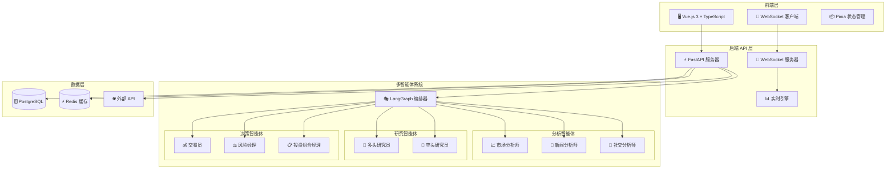
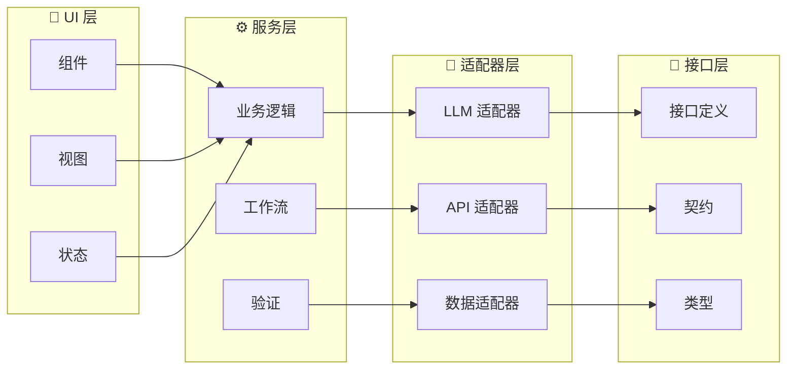
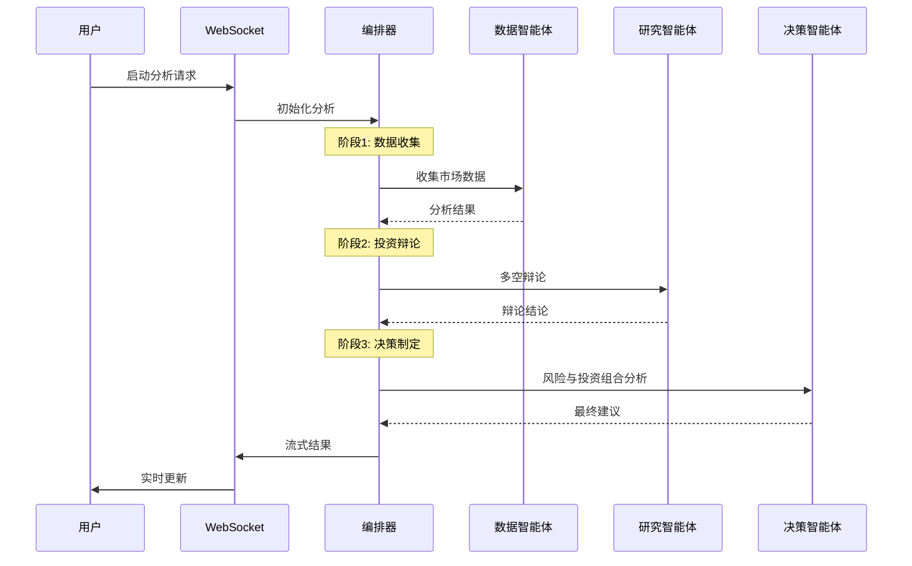
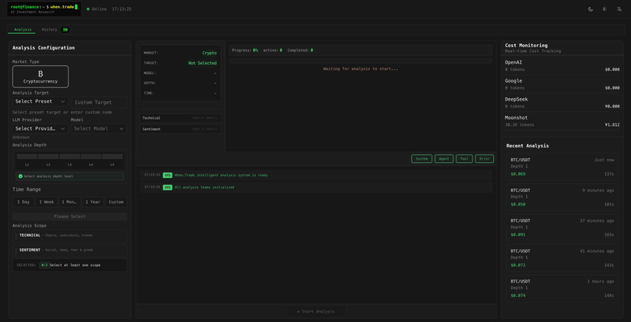
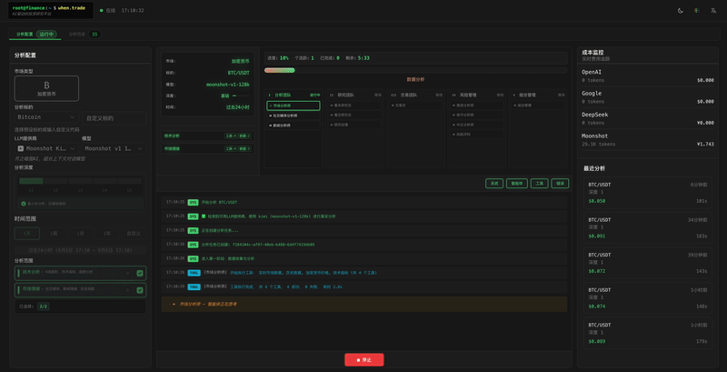
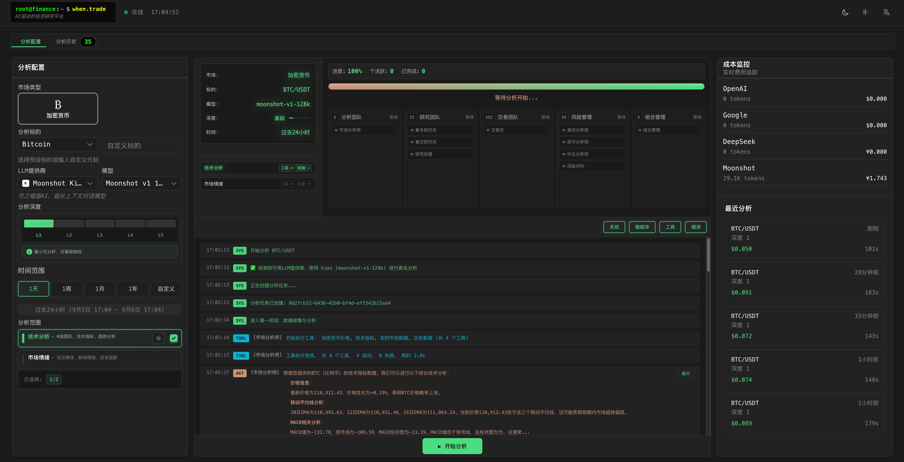
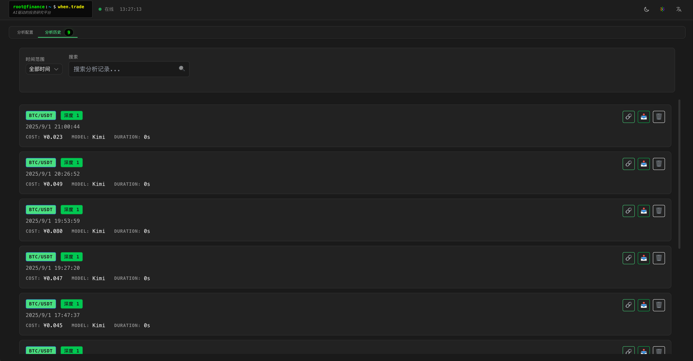

<div align="center">
  <h1>⚡ When.Trade</h1>
  <p><strong>AI 驱动的多智能体投资分析平台</strong></p>
  <p>通过协作式 AI 智能体实现智能市场分析 • 灵感来源于 <a href="https://github.com/TauricResearch/TradingAgents">TradingAgents</a></p>

  <!-- 语言选择 -->
  <p>
    <a href="README.md">🇺🇸 English</a> |
    <a href="README-zh_CN.md">🇨🇳 中文</a>
  </p>

  <!-- 徽章 -->
  <p>
    <a href="https://python.org"></a>
    <a href="https://fastapi.tiangolo.com"></a>
    <a href="https://vuejs.org"></a>
    <a href="LICENSE"></a>
    <a href="CONTRIBUTING.md"></a>
  </p>

  <p>
    <a href="https://github.com/foldedcode/WhenTrade/stargazers"></a>
    <a href="https://github.com/foldedcode/WhenTrade/network/members"></a>
    <a href="https://github.com/foldedcode/WhenTrade/watchers"></a>
  </p>
</div>

## 📋 目录

- [✨ 项目简介](#-项目简介)
- [🚀 核心特性](#-核心特性)
- [🏗️ 系统架构](#️-系统架构)
- [💻 技术栈](#-技术栈)
- [⚡ 快速开始](#-快速开始)
- [📸 项目截图](#-项目截图)
- [📖 使用示例](#-使用示例)
- [🏢 项目结构](#-项目结构)
- [⭐ Star 历史](#-star-历史)
- [🙏 致谢](#-致谢)
- [📄 开源许可](#-开源许可)

## ✨ 项目简介

When.Trade 是一个**开源的 AI 驱动投资分析平台**，通过智能多智能体协作革命性地改变市场分析方式。

基于 **[TradingAgents](https://github.com/TauricResearch/TradingAgents)** 项目奠定的创新基础，本项目实现了一个复杂的生态系统，专业化的 AI 智能体协同工作来：

- 🔍 **分析**来自多源的复杂市场数据
- 💭 **辩论**多空双方的投资策略观点
- ⚖️ **评估**全面的风险场景分析
- 📊 **生成**可执行的投资建议

## 🚀 核心特性

| 特性                  | 描述                                                | 优势                       |
| --------------------- | --------------------------------------------------- | -------------------------- |
| ⚡ **实时分析**       | 基于 WebSocket 的实时数据流和即时结果               | 获取最新市场洞察           |
| 🧠 **多 LLM 支持**    | 支持 OpenAI、Anthropic、DeepSeek、Kimi 等多个提供商 | AI 推理的灵活性和冗余性    |
| 📊 **统一数据接口**   | 集成多个数据源并具备自动故障转移                    | 可靠的数据访问和一致性     |
| 🎯 **高级风险管理**   | 多视角风险评估和场景分析                            | 增强投资组合保护           |
| 🔄 **LangGraph 编排** | 通过状态图管理复杂的分析工作流                      | 可扩展和可维护的智能体协调 |

## 🏗️ 系统架构

### 系统概览



### 四层架构



### 多智能体工作流程



## 💻 技术栈

<div align="center">

### 🐍 后端技术

| 分类          | 技术                  | 版本   | 用途           |
| ------------- | --------------------- | ------ | -------------- |
| 🚀 **框架**   | FastAPI               | 0.109+ | 高性能异步 API |
| 🧠 **AI/ML**  | LangChain + LangGraph | 最新版 | 多智能体编排   |
| 🗄️ **数据库** | PostgreSQL            | 15+    | 主数据存储     |
| ⚡ **缓存**   | Redis                 | 7+     | 高速缓存       |
| 🔄 **队列**   | Celery                | 5.3+   | 后台任务处理   |
| 🧪 **测试**   | pytest                | 7.4+   | 综合测试套件   |

### 🎨 前端技术

| 分类            | 技术         | 版本   | 用途                |
| --------------- | ------------ | ------ | ------------------- |
| ⚛️ **框架**     | Vue.js       | 3.3+   | 响应式用户界面      |
| 📘 **语言**     | TypeScript   | 5.6+   | 类型安全开发        |
| ⚡ **构建工具** | Vite         | 7.0+   | 快速开发和构建      |
| 🎨 **样式**     | Tailwind CSS | 最新版 | 实用优先的 CSS 框架 |
| 📊 **状态管理** | Pinia        | 最新版 | 类型安全状态管理    |
| 📈 **图表**     | Chart.js     | 4.4+   | 金融数据可视化      |

### 🤖 LLM 集成

| 提供商          | 模型                 | 特性               |
| --------------- | -------------------- | ------------------ |
| 🤖 **OpenAI**   | GPT-4, GPT-3.5-turbo | 工具调用、推理     |
| 🌐 **Google**   | Gemini Pro, Gemini   | 多模态、高效推理   |
| 🇨🇳 **DeepSeek** | DeepSeek             | 性能优异，价格便宜 |
| 🌙 **Kimi**     | Moonshot-Kimi        | 实时数据处理       |

</div>

## ⚡ 快速开始

### 系统要求

<details>
<summary>📋 系统要求</summary>

| 组件           | 最低要求 | 推荐配置 |
| -------------- | -------- | -------- |
| **Python**     | 3.9+     | 3.11+    |
| **Node.js**    | 16+      | 18+      |
| **PostgreSQL** | 15+      | 16+      |
| **Redis**      | 7+       | 7+       |

</details>

### 🛠️ 手动安装

<details>
<summary>1️⃣ 克隆仓库</summary>

```bash
git clone https://github.com/foldedcode/WhenTrade.git
cd when.trade
```

</details>

<details>
<summary>2️⃣ 后端设置</summary>

```bash
# 创建 conda 环境
conda create -n whentrade python=3.11
conda activate whentrade

# 安装依赖
pip install -r requirements.txt

# 设置数据库
createdb whentrade_new
alembic upgrade head
```

</details>

<details>
<summary>3️⃣ 前端设置</summary>

```bash
cd web
npm install
# 或使用 yarn
yarn install
```

</details>

<details>
<summary>4️⃣ 环境配置</summary>

```bash
# 复制环境模板
cp .env.example .env

# 编辑配置（必需）
nano .env  # 添加您的 API 密钥和数据库设置
```

**可选的 API 密钥（根据需要配置）：**

- `OPENAI_API_KEY` - 从 [OpenAI](https://platform.openai.com/) 获取
- `DEEPSEEK_API_KEY` - 从 [DeepSeek](https://platform.deepseek.com/) 获取
- `KIMI_API_KEY` - 从 [Kimi (月之暗面)](https://platform.moonshot.cn/) 获取
- `GOOGLE_API_KEY` - 从 [Google AI Studio](https://makersuite.google.com/) 获取
- `FINNHUB_API_KEY` - 从 [Finnhub](https://finnhub.io/) 获取
- `COINGECKO_API_KEY` - 从 [CoinGecko](https://www.coingecko.com/api) 获取
- `REDDIT_CLIENT_ID` 与 `REDDIT_CLIENT_SECRET` - 从 [Reddit 应用](https://www.reddit.com/prefs/apps) 获取

</details>

### 🚀 启动应用

**方式 1: 使用启动脚本**

```bash
# 启动后端
./start.sh

# 启动前端（新终端）
cd web && npm run dev
```

**方式 2: 手动启动**

```bash
# 终端 1: 后端
conda activate whentrade
uvicorn core.main:app --reload --host 0.0.0.0 --port 8000

# 终端 2: 前端
cd web
npm run dev
```

**方式 3: 生产模式**

```bash
# 构建并启动生产版本
npm run build
python -m uvicorn core.main:app --host 0.0.0.0 --port 8000
```

### 🔗 访问入口

| 服务              | URL                                                        | 描述            |
| ----------------- | ---------------------------------------------------------- | --------------- |
| 🖥️ **前端**       | [http://localhost:3000](http://localhost:3000)             | 主应用界面      |
| 📡 **API 服务器** | [http://localhost:8000](http://localhost:8000)             | 后端 API 端点   |
| 📚 **API 文档**   | [http://localhost:8000/docs](http://localhost:8000/docs)   | 交互式 API 文档 |
| 🔍 **API Redoc**  | [http://localhost:8000/redoc](http://localhost:8000/redoc) | 替代 API 文档   |

### ✅ 验证

```bash
# 检查后端健康状态
curl http://localhost:8000/health

# 检查 WebSocket 连接
wscat -c ws://localhost:8000/ws/analysis

# 运行测试
pytest  # 后端测试
npm test  # 前端测试
```

## 📸 项目截图

<div align="center">

### 🎬 在线演示

<table>
<tr>
<td align="center">
<br>
<em>实时多智能体分析</em>
</td>
<td align="center">
<br>
<em>投资研究与风险评估</em>
</td>
</tr>
</table>

### 🖥️ 产品界面

<table>
<tr>
<td align="center">
<br>
</td>
<td align="center">
<br>
</td>
</tr>
<tr>
<td align="center" colspan="2">
<br>
</td>
</tr>
</table>

### 🎬 产品特色

**实时多智能体分析** - 协作式 AI 智能体团队工作
**专业投资洞察** - 多头 vs 空头研究辩论
**全面风险评估** - 多角度场景分析
**现代化 Web 界面** - Vue.js 3 响应式设计

</div>

## 🏢 项目结构

```
when.trade/                         # 📁 项目根目录
├── 🐍 core/                        # 后端应用
│   ├── 🤖 agents/                  # 多智能体系统
│   │   ├── 📄 base.py              # 智能体基类 (⚠️ 1,344 行)
│   │   ├── 📊 analysts/            # 市场分析智能体
│   │   │   ├── market_analyst.py   # 技术与价格分析
│   │   │   ├── news_analyst.py     # 新闻情感分析
│   │   │   ├── fundamentals_analyst.py # 基本面分析
│   │   ├── 🔬 researchers/         # 投资研究智能体
│   │   │   ├── bull_researcher.py  # 多头研究
│   │   │   └── bear_researcher.py  # 空头研究
│   │   ├── 👥 managers/            # 管理智能体
│   │   │   ├── research_manager.py # 研究协调
│   │   │   ├── risk_manager.py     # 风险评估
│   │   │   └── portfolio_manager.py # 投资组合管理
│   │   ├── ⚖️ risk_mgmt/           # 风险管理智能体
│   │   ├── 🧰 utils/               # 智能体工具 (⚠️ 1,602 行)
│   │   └── 🏭 factory.py           # 动态智能体工厂
│   ├── 🌐 api/                     # API 层
│   │   └── v1/routes/              # API 路由
│   │       ├── analysis_ws.py      # WebSocket 处理器 (⚠️ 2,510 行)
│   │       ├── analysis.py         # 分析 REST API
│   │       └── agents.py           # 智能体管理 API
│   ├── 🔄 services/                # 业务逻辑层
│   ├── 🔌 adapters/                # 外部集成
│   │   ├── llm_adapters/           # LLM 提供商适配器
│   │   ├── data_adapters/          # 市场数据适配器
│   │   └── api_adapters/           # 外部 API 适配器
│   ├── 📊 dataflows/               # 数据处理层
│   │   ├── interface.py            # 统一数据接口 (⚠️ 1,624 行)
│   │   └── realtime_news_utils.py  # 实时新闻处理
│   ├── 🎭 graph/                   # LangGraph 编排
│   │   └── whentrade_graph.py      # 主工作流图
│   ├── 🗄️ database/               # 数据库层
│   ├── ⚙️ config/                  # 配置管理
│   └── 📄 main.py                  # FastAPI 应用入口
│
├── 🎨 web/                         # 前端应用 (197 文件)
│   ├── src/
│   │   ├── 🧩 components/          # Vue.js 组件
│   │   │   ├── analysis/           # 分析界面组件
│   │   │   ├── common/             # 可复用组件
│   │   ├── 📦 stores/              # Pinia 状态管理
│   │   │   ├── analysis.ts         # 分析状态
│   │   │   ├── agents.ts           # 智能体状态
│   │   │   └── websocket.ts        # WebSocket 状态
│   │   ├── 🔧 services/            # 前端业务逻辑
│   │   ├── 🔌 adapters/            # 前端 API 适配器
│   │   ├── 🎨 assets/              # 静态资源
│   │   └── 📱 views/               # 页面视图
│   ├── 📦 package.json             # Node.js 依赖
│   └── ⚙️ vite.config.ts           # Vite 配置
│
├── ⚙️ configs/                     # 配置文件
├── 🚀 scripts/                     # 部署与工具脚本
├── 📚 docs/                        # 文档
│   ├── images/                     # README 图片与截图
│   └── diagrams/                   # 架构图表
├── 🧪 tests/                       # 测试套件
├── 🗃️ alembic/                     # 数据库迁移
└── 📄 README.md                    # 项目文档
```

### 📊 关键指标

| 分类                | 数量    | 备注                     |
| ------------------- | ------- | ------------------------ |
| **Python 文件**     | 150+    | 后端实现                 |
| **TypeScript 文件** | 197     | 前端实现                 |
| **总代码行数**      | 50,000+ | 估计项目规模             |
| **大文件**          | 6       | 文件 >1,000 行（见警告） |
| **测试覆盖率**      | 80%+    | 综合测试套件             |

### ⚠️ 大文件导航

为了优化开发体验，对这些文件使用基于符号的导航：

| 文件                           | 行数  | 导航策略           |
| ------------------------------ | ----- | ------------------ |
| `agents/base.py`               | 1,344 | 使用基于类的导航   |
| `agents/utils/agent_utils.py`  | 1,602 | 使用基于函数的搜索 |
| `api/v1/routes/analysis_ws.py` | 2,510 | 使用基于端点的导航 |
| `dataflows/interface.py`       | 1,624 | 使用基于方法的搜索 |

## ⭐ Star 历史

[](https://star-history.com/#foldedcode/WhenTrade&Date)

## 🙏 致谢

<div align="center">

### 🎯 核心灵感

**[TradingAgents](https://github.com/TauricResearch/TradingAgents)** - 启发我们多智能体金融分析方法的先驱项目。

### 🛠️ 技术合作伙伴

| 技术                                        | 贡献                |
| ------------------------------------------- | ------------------- |
| **[LangChain](https://langchain.com)**      | 多智能体编排框架    |
| **[FastAPI](https://fastapi.tiangolo.com)** | 高性能异步 Web 框架 |
| **[Vue.js](https://vuejs.org)**             | 响应式前端框架      |
| **[PostgreSQL](https://postgresql.org)**    | 强大的数据库系统    |
| **[Redis](https://redis.io)**               | 高速缓存解决方案    |

</div>

### 📢 免责声明

> **⚠️ 重要提示**: 本软件**仅用于教育和研究目的**。
>
> - **不要**在没有适当风险管理的情况下用于实际交易
> - 在做任何投资决策之前进行充分的尽职调查
> - 过去的表现不能保证未来的结果
> - 作者对任何财务损失不承担责任

## 📄 开源协议

本项目采用 **MIT 开源协议** - 详情请查看 [LICENSE](LICENSE) 文件。

---

<div align="center">
  <p><strong>由 When.Trade 社区用 ❤️ 构建</strong></p>
  <p>
    <a href="https://github.com/foldedcode/WhenTrade/stargazers">⭐ 在 GitHub 上给我们 Star</a> •
    <a href="https://github.com/foldedcode/WhenTrade/issues">🐛 报告问题</a> •
    <a href="CONTRIBUTING.md">🤝 参与贡献</a>
  </p>
</div>
