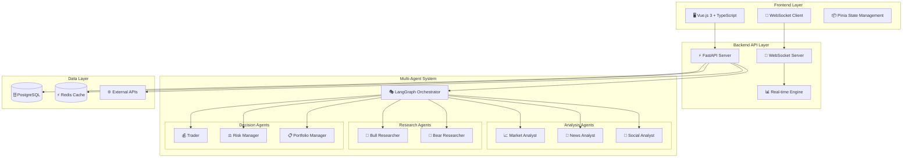
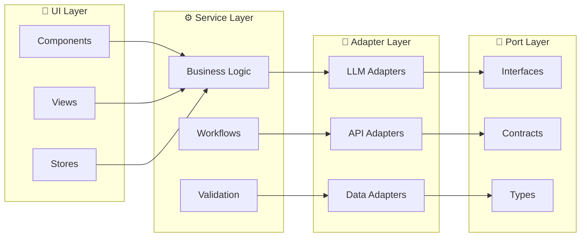
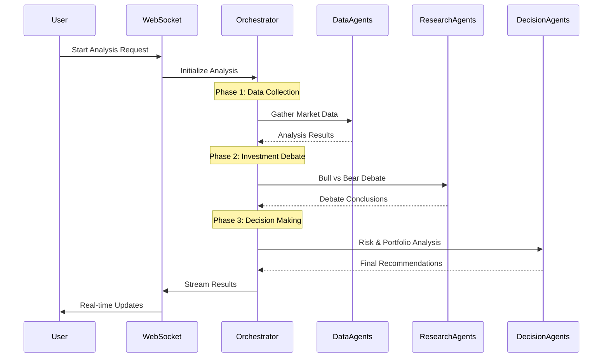
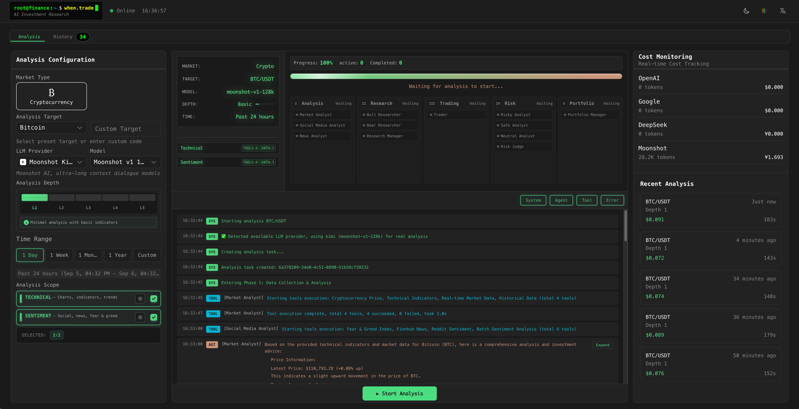
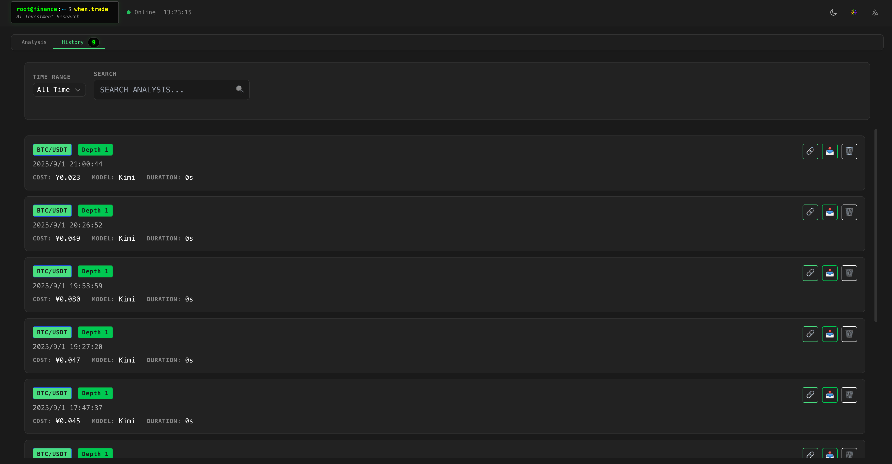
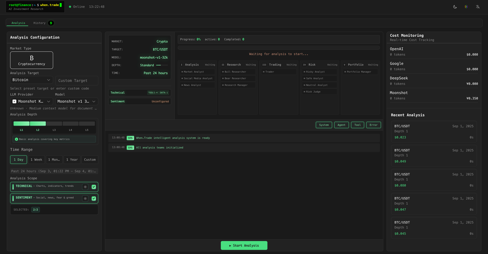

<div align="center">
  <h1>⚡ When.Trade</h1>
  <p><strong>AI-Powered Multi-Agent Investment Analysis Platform</strong></p>
  <p>Intelligent market analysis through collaborative AI agents • Inspired by <a href="https://github.com/TauricResearch/TradingAgents">TradingAgents</a></p>

  <!-- Language Selection -->
  <p>
    <a href="README.md">🇺🇸 English</a> |
    <a href="README-zh_CN.md">🇨🇳 中文</a>
  </p>

  <!-- Badges -->
  <p>
    <a href="https://python.org"></a>
    <a href="https://fastapi.tiangolo.com"></a>
    <a href="https://vuejs.org"></a>
    <a href="LICENSE"></a>
    <a href="CONTRIBUTING.md"></a>
  </p>

  <p>
    <a href="https://github.com/foldedcode/when.trade/stargazers"></a>
    <a href="https://github.com/foldedcode/when.trade/network/members"></a>
    <a href="https://github.com/foldedcode/when.trade/watchers"></a>
  </p>
</div>

## 📋 Table of Contents

- [✨ Overview](#-overview)
- [🚀 Key Features](#-key-features)
- [🏗️ Architecture](#️-architecture)
- [💻 Tech Stack](#-tech-stack)
- [⚡ Quick Start](#-quick-start)
- [📸 Screenshots](#-screenshots)
- [📖 Usage Examples](#-usage-examples)
- [🏢 Project Structure](#-project-structure)
- [⭐ Star History](#-star-history)
- [🙏 Acknowledgments](#-acknowledgments)
- [📄 License](#-license)

## ✨ Overview

When.Trade is an **open-source AI-powered investment analysis platform** that revolutionizes market analysis through intelligent multi-agent collaboration.

Building upon the innovative foundation laid by **[TradingAgents](https://github.com/TauricResearch/TradingAgents)**, this project implements a sophisticated ecosystem where specialized AI agents work together to:

- 🔍 **Analyze** complex market data from multiple sources
- 💭 **Debate** investment strategies through Bull vs Bear perspectives  
- ⚖️ **Assess** comprehensive risk scenarios
- 📊 **Generate** actionable investment recommendations

## 🚀 Key Features

| Feature | Description | Benefits |
|---------|-------------|----------|
| ⚡ **Real-time Analysis** | WebSocket-based live data streaming and instant results | Up-to-the-minute market insights |
| 🧠 **Multiple LLM Support** | OpenAI, Anthropic, DeepSeek, Kimi, and other providers | Flexibility and redundancy in AI reasoning |
| 📊 **Unified Data Interface** | Integrated multiple data sources with automatic failover | Reliable data access and consistency |
| 🎯 **Advanced Risk Management** | Multi-perspective risk assessment and scenario analysis | Enhanced portfolio protection |
| 🔄 **LangGraph Orchestration** | Complex analysis workflows managed through state graphs | Scalable and maintainable agent coordination |

## 🏗️ Architecture

### System Overview



### Four-Layer Architecture



### Multi-Agent Workflow



## 💻 Tech Stack

<div align="center">

### 🐍 Backend Technologies

| Category | Technology | Version | Purpose |
|----------|------------|---------|---------|
| 🚀 **Framework** | FastAPI | 0.109+ | High-performance async API |
| 🧠 **AI/ML** | LangChain + LangGraph | Latest | Multi-agent orchestration |
| 🗄️ **Database** | PostgreSQL | 15+ | Primary data storage |
| ⚡ **Cache** | Redis | 7+ | High-speed caching |
| 🔄 **Queue** | Celery | 5.3+ | Background task processing |
| 🧪 **Testing** | pytest | 7.4+ | Comprehensive testing suite |

### 🎨 Frontend Technologies

| Category | Technology | Version | Purpose |
|----------|------------|---------|---------|
| ⚛️ **Framework** | Vue.js | 3.3+ | Reactive user interface |
| 📘 **Language** | TypeScript | 5.6+ | Type-safe development |
| ⚡ **Build Tool** | Vite | 7.0+ | Fast development and builds |
| 🎨 **Styling** | Tailwind CSS | Latest | Utility-first CSS framework |
| 📊 **State** | Pinia | Latest | Type-safe state management |
| 📈 **Charts** | Chart.js | 4.4+ | Financial data visualization |

### 🤖 LLM Integrations

| Provider | Models | Features |
|----------|--------|-----------|
| 🤖 **OpenAI** | GPT-4, GPT-3.5-turbo | Tool calling, reasoning |
| 🌐 **Google** | Gemini Pro, Gemini | Multimodal, efficient reasoning |
| 🇨🇳 **DeepSeek** | DeepSeek | High performance, cost-effective |
| 🌙 **Kimi** | Moonshot-Kimi | Real-time data processing |

</div>

## ⚡ Quick Start

### Prerequisites

<details>
<summary>📋 System Requirements</summary>

| Component | Minimum | Recommended |
|-----------|---------|-------------|
| **Python** | 3.9+ | 3.11+ |
| **Node.js** | 16+ | 18+ |
| **PostgreSQL** | 15+ | 16+ |
| **Redis** | 7+ | 7+ |

</details>

### 🛠️ Manual Installation

<details>
<summary>1️⃣ Clone Repository</summary>

```bash
git clone https://github.com/foldedcode/when.trade.git
cd when.trade
```

</details>

<details>
<summary>2️⃣ Backend Setup</summary>

```bash
# Create conda environment
conda create -n whentrade python=3.11
conda activate whentrade

# Install dependencies
pip install -r requirements.txt

# Setup database
createdb whentrade_new
alembic upgrade head
```

</details>

<details>
<summary>3️⃣ Frontend Setup</summary>

```bash
cd web
npm install
# or use yarn
yarn install
```

</details>

<details>
<summary>4️⃣ Environment Configuration</summary>

```bash
# Copy environment template
cp .env.example .env

# Edit configuration (required)
nano .env  # Add your API keys and database settings
```

**Optional API Keys (Configure based on your needs):**

- `OPENAI_API_KEY` - Get from [OpenAI](https://platform.openai.com/)
- `DEEPSEEK_API_KEY` - Get from [DeepSeek](https://platform.deepseek.com/)
- `KIMI_API_KEY` - Get from [Kimi (Moonshot AI)](https://platform.moonshot.cn/)
- `GOOGLE_API_KEY` - Get from [Google AI Studio](https://makersuite.google.com/)
- `FINNHUB_API_KEY` - Get from [Finnhub](https://finnhub.io/)
- `COINGECKO_API_KEY` - Get from [CoinGecko](https://www.coingecko.com/api)
- `REDDIT_CLIENT_ID` & `REDDIT_CLIENT_SECRET` - Get from [Reddit Apps](https://www.reddit.com/prefs/apps)

</details>

### 🚀 Launch Application

**Option 1: Using Start Scripts**

```bash
# Start backend
./start.sh

# Start frontend (new terminal)
cd web && npm run dev
```

**Option 2: Manual Start**

```bash
# Terminal 1: Backend
conda activate whentrade
uvicorn core.main:app --reload --host 0.0.0.0 --port 8000

# Terminal 2: Frontend  
cd web
npm run dev
```

**Option 3: Production Mode**

```bash
# Build and start production
npm run build
python -m uvicorn core.main:app --host 0.0.0.0 --port 8000
```

### 🔗 Access Points

| Service | URL | Description |
|---------|-----|-------------|
| 🖥️ **Frontend** | [http://localhost:3000](http://localhost:3000) | Main application interface |
| 📡 **API Server** | [http://localhost:8000](http://localhost:8000) | Backend API endpoint |
| 📚 **API Docs** | [http://localhost:8000/docs](http://localhost:8000/docs) | Interactive API documentation |
| 🔍 **API Redoc** | [http://localhost:8000/redoc](http://localhost:8000/redoc) | Alternative API documentation |

### ✅ Verification

```bash
# Check backend health
curl http://localhost:8000/health

# Check WebSocket connection
wscat -c ws://localhost:8000/ws/analysis

# Run tests
pytest  # Backend tests
npm test  # Frontend tests
```

## 📸 Screenshots

<div align="center">

### 🖥️ Product Interface

<table>
<tr>
<td align="center">
<br>
</td>
<td align="center">
<br>
</td>
</tr>
<tr>
<td align="center" colspan="2">
<br>
</td>
</tr>
</table>

### 🎬 Product Features

- **Real-time Multi-Agent Analysis** - Collaborative AI agents working together
- **Professional Investment Insights** - Bull vs Bear research debates  
- **Comprehensive Risk Assessment** - Multi-perspective scenario analysis
- **Modern Web Interface** - Vue.js 3 with responsive design

</div>

## 🏢 Project Structure

```
when.trade/                         # 📁 Project Root
├── 🐍 core/                        # Backend Application
│   ├── 🤖 agents/                  # Multi-Agent System
│   │   ├── 📄 base.py              # Agent Base Classes (⚠️ 1,344 lines)
│   │   ├── 📊 analysts/            # Market Analysis Agents
│   │   │   ├── market_analyst.py   # Technical & Price Analysis
│   │   │   ├── news_analyst.py     # News Sentiment Analysis  
│   │   │   └── fundamentals_analyst.py # Fundamental Analysis
│   │   ├── 🔬 researchers/         # Investment Research Agents
│   │   │   ├── bull_researcher.py  # Bullish Case Research
│   │   │   └── bear_researcher.py  # Bearish Case Research
│   │   ├── 👥 managers/            # Management Agents
│   │   │   ├── research_manager.py # Research Coordination
│   │   │   ├── risk_manager.py     # Risk Assessment
│   │   │   └── portfolio_manager.py # Portfolio Management
│   │   ├── ⚖️ risk_mgmt/           # Risk Management Agents
│   │   ├── 🧰 utils/               # Agent Utilities (⚠️ 1,602 lines)
│   │   └── 🏭 factory.py           # Dynamic Agent Factory
│   ├── 🌐 api/                     # API Layer
│   │   └── v1/routes/              # API Routes
│   │       ├── analysis_ws.py      # WebSocket Handler (⚠️ 2,510 lines)
│   │       ├── analysis.py         # Analysis REST API
│   │       └── agents.py           # Agent Management API
│   ├── 🔄 services/                # Business Logic Layer
│   ├── 🔌 adapters/                # External Integrations
│   │   ├── llm_adapters/           # LLM Provider Adapters
│   │   ├── data_adapters/          # Market Data Adapters
│   │   └── api_adapters/           # External API Adapters
│   ├── 📊 dataflows/               # Data Processing Layer
│   │   ├── interface.py            # Unified Data Interface (⚠️ 1,624 lines)
│   │   └── realtime_news_utils.py  # Real-time News Processing
│   ├── 🎭 graph/                   # LangGraph Orchestration
│   │   └── whentrade_graph.py      # Main Workflow Graph
│   ├── 🗄️ database/               # Database Layer
│   ├── ⚙️ config/                  # Configuration Management
│   └── 📄 main.py                  # FastAPI Application Entry
│
├── 🎨 web/                         # Frontend Application (197 files)
│   ├── src/
│   │   ├── 🧩 components/          # Vue.js Components
│   │   │   ├── analysis/           # Analysis Interface Components
│   │   │   └── common/             # Reusable Components
│   │   ├── 📦 stores/              # Pinia State Management
│   │   │   ├── analysis.ts         # Analysis State
│   │   │   ├── agents.ts           # Agent State
│   │   │   └── websocket.ts        # WebSocket State
│   │   ├── 🔧 services/            # Frontend Business Logic
│   │   ├── 🔌 adapters/            # Frontend API Adapters
│   │   ├── 🎨 assets/              # Static Assets
│   │   └── 📱 views/               # Page Views
│   ├── 📦 package.json             # Node.js Dependencies
│   └── ⚙️ vite.config.ts           # Vite Configuration
│
├── ⚙️ configs/                     # Configuration Files
├── 🚀 scripts/                     # Deployment & Utility Scripts
├── 📚 docs/                        # Documentation
│   ├── images/                     # README Images & Screenshots
│   └── diagrams/                   # Architecture Diagrams
├── 🧪 tests/                       # Test Suites
├── 🗃️ alembic/                     # Database Migrations
└── 📄 README.md                    # Project Documentation
```

### 📊 Key Metrics

| Category | Count | Notes |
|----------|-------|-------|
| **Python Files** | 150+ | Backend implementation |
| **TypeScript Files** | 197 | Frontend implementation |
| **Total Lines of Code** | 50,000+ | Estimated project size |
| **Large Files** | 6 | Files >1,000 lines (see warnings) |
| **Test Coverage** | 80%+ | Comprehensive test suite |

### ⚠️ Large File Navigation

For optimal development experience, use symbol-based navigation for these files:

| File | Lines | Navigation Strategy |
|------|-------|-------------------|
| `agents/base.py` | 1,344 | Use class-based navigation |
| `agents/utils/agent_utils.py` | 1,602 | Use function-based search |
| `api/v1/routes/analysis_ws.py` | 2,510 | Use endpoint-based navigation |
| `dataflows/interface.py` | 1,624 | Use method-based search |

## ⭐ Star History

[](https://star-history.com/#foldedcode/WhenTrade&Date)

## 🙏 Acknowledgments

<div align="center">

### 🎯 Core Inspiration

**[TradingAgents](https://github.com/TauricResearch/TradingAgents)** - The pioneering project that inspired our multi-agent approach to financial analysis.

### 🛠️ Technology Partners

| Technology | Contribution |
|------------|--------------|
| **[LangChain](https://langchain.com)** | Multi-agent orchestration framework |
| **[FastAPI](https://fastapi.tiangolo.com)** | High-performance async web framework |
| **[Vue.js](https://vuejs.org)** | Reactive frontend framework |
| **[PostgreSQL](https://postgresql.org)** | Robust database system |
| **[Redis](https://redis.io)** | High-speed caching solution |

### 👥 Community

Special thanks to all contributors who have helped shape this project.

</div>

## 📄 License

This project is licensed under the **MIT License** - see the [LICENSE](LICENSE) file for details.

### 📢 Disclaimer

> **⚠️ Important**: This software is for **educational and research purposes only**.
>
> - Do **not** use for actual trading without proper risk management
> - Perform thorough due diligence before any investment decisions
> - Past performance does not guarantee future results
> - Authors are not responsible for any financial losses

---

<div align="center">
  <p><strong>Built with ❤️ by the When.Trade community</strong></p>
  <p>
    <a href="https://github.com/foldedcode/when.trade/stargazers">⭐ Star us on GitHub</a> •
    <a href="https://github.com/foldedcode/when.trade/issues">🐛 Report Issues</a> •
    <a href="CONTRIBUTING.md">🤝 Contribute</a>
  </p>
</div>
